# **Módulo 1 - Criando uma Ferramenta de Controle de Investimentos com Excel**

## > **Concluído em 04/06/2025**

## **Texto do Desafio:**

O projeto consiste na criação de uma ferramenta simples em Excel para simular investimentos em fundos imobiliários. A planilha permite calcular o valor total investido, o patrimônio acumulado e os dividendos mensais, ajudando o usuário a entender melhor o impacto de seus investimentos ao longo do tempo. Este modelo pode ser usado como base para futuras expansões e personalizações, oferecendo uma solução prática e acessível para investidores iniciantes.

**OBJETIVOS DA APRENDIZAGEM:**

* Criar ferramentas de simulação de investimentos em Excel.  
* Aplicar cálculos financeiros como rendimento mensal e cálculo de dividendos.  
* Documentar processos técnicos de forma clara e estruturada.   
* Utilizar o GitHub como ferramenta para compartilhamento de documentação técnica.

**ENTREGA DO DESAFIO (Para concluir este desafio, você deverá:)** 

* Assistir a todas as vídeo-aulas.  
* Não pule nenhuma etapa\! As aulas contêm informações essenciais para o sucesso do seu projeto.   
* Criar um repositório público no GitHub contendo um arquivo README.md detalhado.  
* Quaisquer arquivos adicionais que sejam relevantes para documentar sua experiência.  
* Opcionalmente, capturas de tela relevantes organizadas em uma pasta /images   
* Enviar o link do seu repositório e uma breve descrição clicando no botão “Entregar Projeto”.

**MINHA DESCRIÇÃO:**

O desafio consiste em ir acompanhando os vídeos onde o instrutor vai fazendo a sua versão e você com esse conhecimento constroi a sua. Os vídeos são divididos nas categorias abaixo.

**PS: Eu não usei o Excel e sim o LibreOffice Calc para o desafio.**

0 \- introdução

Alguns breves comentários do instrutor sobre o desafio.

1 \- Perguntas de Negócio

* Quanto investir por mês?  
* Por quantos anos?  
* Taxa de rendimento mensal  
* Patrimônio Acumulado?  
* Dividendo mensais?

2 \- Pré-requisitos

Nada de interessante a relatar.

3 \- Base da Tabela

Aqui eu criei a base visual para ser usada na tabela.

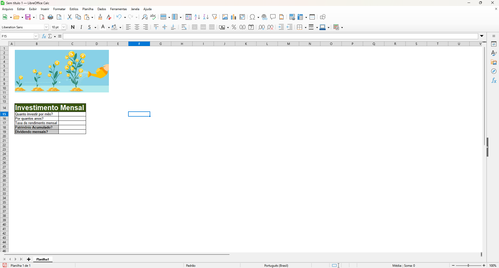

4 \- Simulador de Patrimônio (1%)

Foram usados números aleatórios para preencher a tabela.

usei a fórmula \=vf para ter o retorno do patrimônio acumulado ao final do investimento

*\=VF(C17;C16\*12;C15\*-1)*

***VF, uma das funções financeiras, calcula o valor futuro de um investimento com base em uma taxa de juros constante. Você pode usar VF com pagamentos periódicos e constantes ou um pagamento de quantia única.***

e para saber o valor dos dividendos mensais a fórmula

*\=C18\*1%*

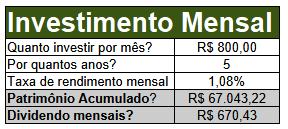

5 \- Simulador de cenários

Aqui eu tive que criar cenários de investimento ao longo de 2, 5, 10, 20 e 30 anos, usando uma variável invisível (foi pintada de branco para ocultar os valores) contendo os números em anos para apoiar a fórmula,

*\=VF($C$17;$A24\*12;$C$15\*-1)*

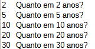
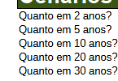

e aí ao lado do valor (coluna chamada dividendo)em anos ele multiplicado por 1% (parece ser um tipo de correção realista de mercado)

*\=C24\*1%*

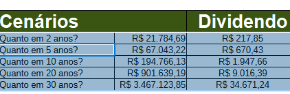

6 \- Variáveis Globais

e se não for 1%?

nesse eu criei um arquivo de configuração onde pode ser digitado o salário, o rendimento da carteira e a sugestão de quanto do salário se deve investir (30%).  
Ao invés de ter que digitar na fórmula ela já vai apontar para esse configuração, só precisando alterar o valor da mesma (ao mudar o valor,   
a coluna dividendo muda de acordo com ele)

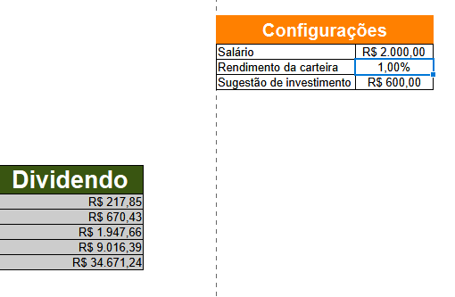
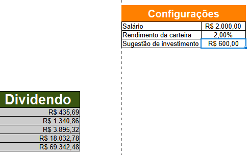

7 \- Nomeando intervalos

Nesse eu tive que nomear as células, ao invés de chamar uma célula de H16, ela pode ser chamada de porcentagem\_de\_rendimento, isso facilita pois caso eu queira chamar nas expressões posso só passar o nome dela.

Isso seria bom caso houvesse muitas variáveis globais, como há poucas só nomeie ele por nomear mesmo, tanto que não mudei as fórmulas, deixei referenciando por número e letra mesmo.

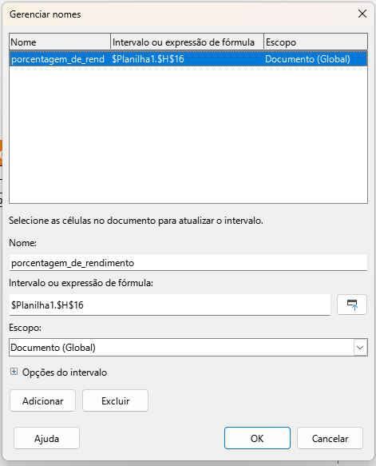

exemplo:

\=C24\*$H$16

também pode ser

\=C24\*porcentagem\_de\_rendimento

8 \- Criando uniformidade visual

Apenas dicas de melhorias visuais, tornando mais amigável visualmente, apliquei algumas.

9 \- Tipos de fundo

Nesse aqui eu criei uma ferramenta para indicar quanto você deve investir em cada **FII** de acordo com o tipo de perfil, conservador, moderado e agressivo.

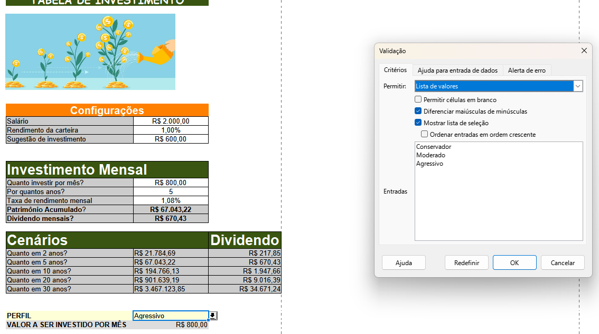
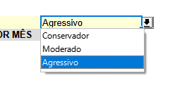

10 \- Conclusão

Criei uma tabela de apoio para mudar a porcentagem de divisão sugerida de acordo com o perfil sugerido. Ao escolher um perfil ele muda as porcentagem de acordo com o mesmo escolhido.

usando a fórmula PROCV para usar a tabela de apoio para mudar os valores.

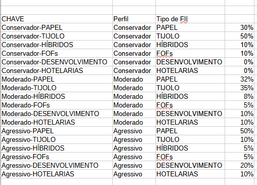
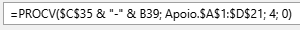
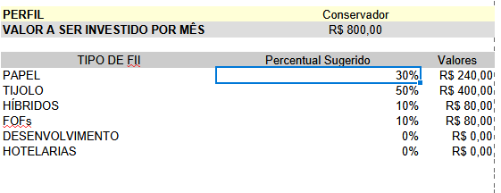
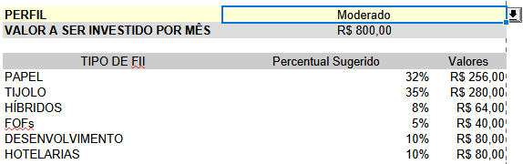
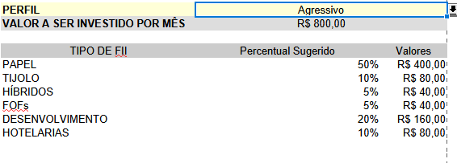

**Tabela Finalizada**

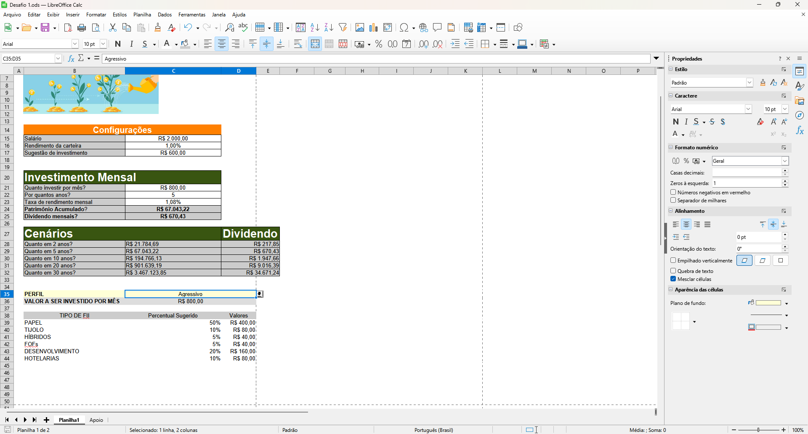

-----------------------------------------------------------------------------------------------------------------------------
[Simulador_Investimentos_Fundos_Imobiliarios_Excel_Resolvido.xlsx](https://hermes.dio.me/files/assets/a04b81b1-8e35-4e72-aeb9-98aed8ed4403.xlsx) - Arquivo com a planilha resolvida para simulação de investimentos em fundos imobiliários.

**Materiais Complementares sobre GitHub**

[GitHub Quick Start](https://github.com/digitalinnovationone/github-quickstart) - Repositório com Link para Aulas de Git e GitHub

[GitBook: Formação GitHub Certification](https://aline-antunes.gitbook.io/formacao-fundamentos-github) - Material textual sobre GitHub
[Documentação do GitHub](https://docs.github.com/) - Guia completo para uso do GitHub

[GitHub Markdown](https://docs.github.com/pt/get-started/writing-on-github/getting-started-with-writing-and-formatting-on-github/basic-writing-and-formatting-syntax) - Guia específico para Markdown no GitHub