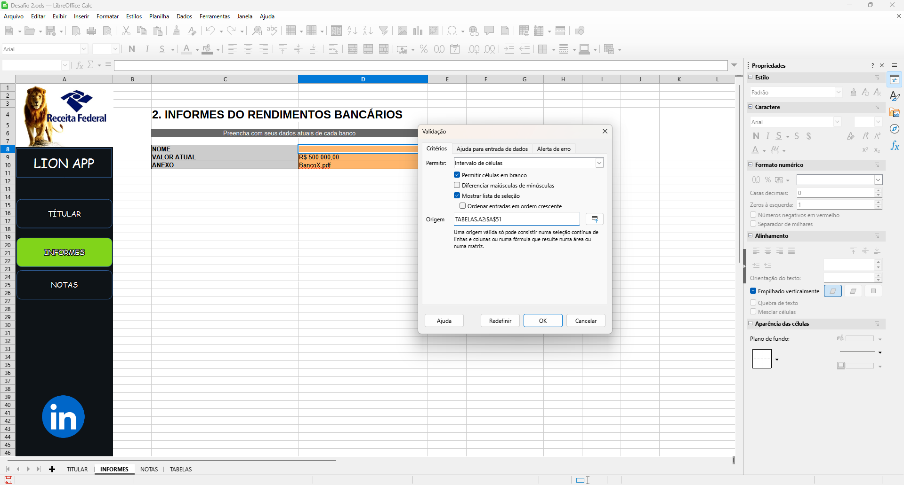

# **Módulo 2 - Criando Um Organizador de Declaração de Imposto de Renda**

## > **Concluído em /06/2025**

## **Texto do Desafio:**

O projeto consiste na criação de uma planilha de controle de dados para facilitar a organização de informações necessárias para a declaração de imposto de renda. A ferramenta será desenvolvida no Excel, utilizando validações de dados, navegação facilitada e funções interativas. Este projeto é ideal para quem busca uma solução prática e profissional para organização de dados fiscais e pode ser um excelente diferencial em seu portfólio.

**Objetivos de Aprendizagem**

Ao concluir este desafio, você será capaz de: 

* Aplicar os conceitos aprendidos em um ambiente prático;
Documentar processos técnicos de forma clara e estruturada.

* Utilizar o GitHub como ferramenta para compartilhamento de documentação técnica. 

**Entrega do Desafio**

Para concluir este desafio, você deverá: 

* Assistir a todas as vídeo-aulas. Não pule nenhuma etapa! As aulas contêm informações essenciais para o sucesso do seu projeto. 

* Criar um repositório público no GitHub contendo: 
Um arquivo README.md detalhado 
Quaisquer arquivos adicionais que sejam relevantes para documentar sua experiência 
Opcionalmente, capturas de tela relevantes organizadas em uma pasta /images.

* Enviar o link do seu repositório e uma breve descrição clicando no botão “Entregar Projeto”.

**Recursos Úteis**

Documentações Oficiais

[Início Rápido: Criar uma máquina virtual do Windows no Portal do Azure](https://learn.microsoft.com/pt-br/azure/virtual-machines/windows/quick-create-portal) - Artigo no Microsoft Learning

**Materiais Complementares sobre GitHub**

[GitHub Quick Start](https://github.com/digitalinnovationone/github-quickstart) - Repositório com Link para Aulas de Git e GitHub.

[GitBook: Formação GitHub Certification](https://aline-antunes.gitbook.io/formacao-fundamentos-github) - Material textual sobre GitHub.

[Documentação do GitHub](https://docs.github.com/) - Guia completo para uso do GitHub.

[GitHub Markdown](https://docs.github.com/pt/get-started/writing-on-github/getting-started-with-writing-and-formatting-on-github/basic-writing-and-formatting-syntax) - Guia específico para Markdown no GitHub.

**Outros Complementares**

[script_de_alinhamentos](https://hermes.dio.me/files/assets/71335e12-6408-4a16-b42a-aef00053c0ff.txt)

[bancos_apoio](https://hermes.dio.me/files/assets/84cd23cc-7cb3-4219-9805-f99069dbbb33.xlsx)

[projeto_completo](https://hermes.dio.me/files/assets/9b65e108-7ed6-456c-bb6b-e66827b322aa.xlsx)

## **Resolução do Desafio (explicações e prints):**

O desafio consiste em ir acompanhando os vídeos onde o instrutor vai fazendo a sua versão e você com esse conhecimento constroi a sua versão. Os vídeos são divididos nas categorias abaixo.

    **PS: Eu não usei o Excel e sim o LibreOffice Calc para o desafio.**

0 \- Introdução

Alguns breves comentários do instrutor sobre o desafio.

1 \- Menu

Aqui eu só preparei a base da interface, não ficou muito bonita, mas eu não queria perder muito tempo aqui.

2 \- Menu items

so adicionei um pouco mais de interface e linquei elas de modo que ao pressionar uma dos botes ele vai para a planilha de link, exemplo ao clicar no botão notas ele abre a parte da planilha de notas

3 \- Criando uma função de excel

Nessa ele mostrou um código em VBA para ajudar a posicionar os ícones sempre em uma posição independente da planilha que você coloque nele. no caso só prestei atenção no vídeo e não fiz pois não achei necessário no atual projeto.

Além de que o LibreOffice não usa o VBC e sim o StarBasic, mas usei o chat GPT para adaptar o código para ele

| Sub MoverFormaParaPosicao     Dim oDoc As Object     Dim oPlanilha As Object     Dim oDesenhos As Object     Dim oForma As Object     Dim nomeIconeProcurado As String     Dim novaPosicaoX As Long     Dim novaPosicaoY As Long     Dim i As Integer     Dim achou As Boolean     oDoc \= ThisComponent     oPlanilha \= oDoc.Sheets(0) ' Altere o índice se quiser outra planilha     oDesenhos \= oPlanilha.DrawPage     nomeIconeProcurado \= "Ícone 1" ' \<-- Troque aqui pelo nome do seu ícone     novaPosicaoX \= 2500 ' em 1/100 mm (por exemplo, 2500 \= 2,5 cm)     novaPosicaoY \= 1000 ' em 1/100 mm (por exemplo, 1000 \= 1 cm)     achou \= False     For i \= 0 To oDesenhos.Count \- 1         oForma \= oDesenhos.getByIndex(i)         If oForma.Name \= nomeIconeProcurado Then             oForma.setPosition(com.sun.star.awt.Point(novaPosicaoX, novaPosicaoY))             MsgBox "Ícone '" & nomeIconeProcurado & "' movido com sucesso\!"             achou \= True             Exit For         End If     Next i     If Not achou Then         MsgBox "Ícone '" & nomeIconeProcurado & "' não encontrado."     End If End Sub |
| :---- |

4 \- Formulário titular

Criei a base visual para o preenchimento dos dados

5 \- Formatações personalizadas

Aqui só foi feita fórmulas para que os dados digitados sejam formados já de forma correspondente

veja um print da do cpf (qualquer número digitado ao final vai ser formato visualmente)

a formatação condicional ocorreu para

CPF 000"."000"."000"-"00  
CEP 00000"-"000  
TELEFONE "("00")"0000"-"0000  
CELULAR "("00")"00000"-"0000

6 \- Tela de Informes

Nessa tela criei um visual para a tela de informes e criei uma tabela de apoio para os códigos bancários, onde através da validação de dados dá pra escolher lá o banco.

7 \- Tela de Notas

Definição do layout e preenchimento com dados aleatórios.

9 \- Toques Finais

Essa aula foi apenas ensinando a deixar o layout mais bonito e como colocar alguns gráficos, exibir certos elementos e como colocar uma senha, tanto geral como para alguns elementos, apenas assisti.

mas veja os prints finais da tabela

## **Ferramentas Usadas:**

[LibreOffice](https://pt-br.libreoffice.org/baixe-ja/libreoffice-novo/)
