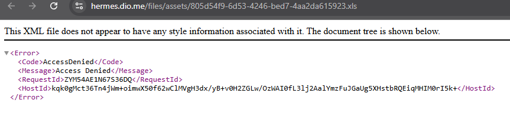

# Módulo 3 \- Criando um Dashboard de Vendas do Xbox com Excel

##  \>\> **Concluído em 06/06/2025 \<\<**

## Texto do Desafio:

Aprenda a criar um dashboard de vendas, com foco na organização e visualização de dados. O objetivo é transformar dados brutos em informações visuais claras e úteis, permitindo uma análise eficaz do desempenho de vendas e a tomada de decisões baseadas em dados.

**O que fazer?**

Criar um dashboard de vendas no Excel.

**Orientações para Entrega (Organizar o repositório do GitHub com:)**

* README.md explicando o projeto, os dados utilizados e instruções para reprodução.  
* O arquivo Excel (.xlsx) com o dashboard concluído.  
* Compartilhar o link do repositório GitHub como entrega do desafio.

**Materiais de Apoio**

Base de Dados: [base.xlsx](https://hermes.dio.me/files/assets/805d54f9-6d53-4246-bed7-4aa2da615923.xls)

Dashboard Finalizado: [dashboard\_xbox\_finalizado.xlsx](https://hermes.dio.me/files/assets/0120950e-64c8-4092-a257-ba22ed198c69.xlsx)

## **Resolução do Desafio (explicações e prints)**

A base de dados usada para fazer essa aula não está abrindo (base.xlsx)

portanto não deu pra fazer, só fiquei assistindo as aulas mesmo.